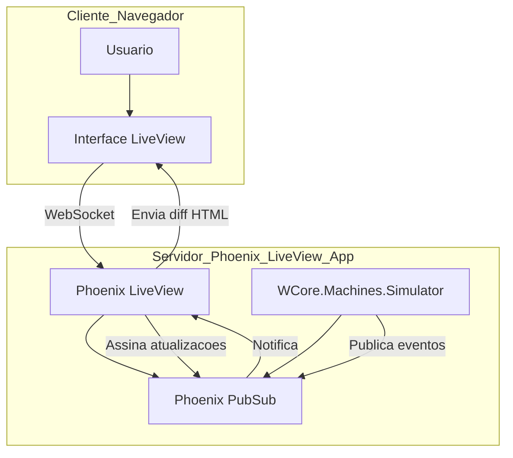

# Step 5 — O Empacotamento para o Edge (Infraestrutura)

## Contexto

Última etapa do desafio: Mesmo com os Passos 1 e 2 mockados para focar no Front-end, é super importante entender como a nossa aplicação Phoenix LiveView, com o Dashboard e o `Simulator` rodando, seria empacotada e entregue para um ambiente de produção, como o "Edge Computing" da Planta 42.

Minha missão aqui foi criar um `Dockerfile` para gerar uma _mix release_ otimizada. No meu contexto, o "banco" que precisa de persistência é o estado do `Simulator` em memória, que é volátil. A ideia é que, ao reiniciar, ele comece do zero, mas a aplicação em si precisa subir de forma robusta.

## O Dockerfile: Empacotando o LiveView para o Mundo

O `Dockerfile` é como uma receita para criar uma "caixa" (um contêiner Docker) que contém tudo o que a nossa aplicação precisa para rodar, sem depender do ambiente onde ela está. Usei um `build multi-stage`, que é uma técnica para criar imagens Docker menores e mais seguras.

### Por que `multi-stage`?

No Front-end, a gente pensa em _bundlers_ como Webpack ou Vite para otimizar o código. O `multi-stage` faz algo parecido para o Docker:

1.  **Stage de Build (`builder`):** Aqui, eu instalo todas as ferramentas necessárias para _compilar_ o Elixir e os assets (CSS/JS). Depois de tudo compilado, essa etapa é descartada.
2.  **Stage de Release (`release`):** Esta é a imagem final. Ela é super pequena porque só copia o resultado da compilação (a _release_ do Elixir) e as dependências mínimas para _rodar_ a aplicação. É como se eu pegasse só o `build` da minha aplicação React e colocasse num servidor Nginx leve, sem levar todo o `node_modules` junto.

### O Dockerfile

```dockerfile
# --- BUILDER STAGE ---
FROM hexpm/elixir:1.16.0-erlang-26.2.2-debian-bookworm-slim AS builder

# Instala dependências de build (git, build-essential)
RUN apt-get update -y && apt-get install -y build-essential git

# Define o diretório de trabalho
WORKDIR /app

# Instala Hex e Rebar (ferramentas do Elixir)
RUN mix local.hex --force && mix local.rebar --force

# Copia arquivos do projeto e baixa dependências de produção
COPY mix.exs mix.lock ./
RUN mix deps.get --only prod

# Copia o restante do código da aplicação
COPY . .

# Compila os assets (CSS/JS) e gera o digest para o Phoenix
RUN mix assets.deploy

# Compila o projeto Elixir e gera a release otimizada
RUN mix compile
RUN mix release --overwrite

# --- RELEASE STAGE ---
FROM debian:bookworm-slim AS release

# Instala dependências de runtime (bibliotecas básicas)
RUN apt-get update -y && apt-get install -y libstdc++6 openssl libncurses5 locales

# Configura o locale
RUN echo "en_US.UTF-8 UTF-8" > /etc/locale.gen && locale-gen
ENV LANG=en_US.UTF-8
ENV LC_ALL=en_US.UTF-8

# Define o diretório de trabalho
WORKDIR /app

# Copia a release compilada do stage anterior
COPY --from=builder /app/_build/prod/rel/w_core ./w_core

# Configura variáveis de ambiente para o Phoenix
ENV PHOENIX_SERVER=true
ENV PORT=4000
EXPOSE 4000

# Comando para iniciar a aplicação
CMD ["/app/w_core/bin/w_core", "start"]
```

## Diagrama Arquitetural: Como Tudo se Conecta

Para um dev Front-end, entender o fluxo de dados é essencial. Este diagrama mostra como o navegador (onde roda a interface LiveView) se conecta com o servidor Phoenix, e como o nosso `Simulator` (o "motor" de estado) atualiza a interface em tempo real via PubSub.



### Explicação do Fluxo:

1.  **Usuário (A) e Interface LiveView (B):** O usuário interage com o Dashboard no navegador, que é renderizado pelo LiveView.
2.  **Conexão WebSocket (B para C):** O LiveView estabelece uma conexão persistente via WebSocket com o servidor Phoenix. Isso é mágico para o Front-end, pois a reatividade acontece sem a gente escrever JavaScript complexo.
3.  **Phoenix LiveView (C):** No servidor, o LiveView gerencia o estado da interface e as interações do usuário.
4.  **Phoenix PubSub (D):** É o "ônibus de eventos" do Phoenix. O LiveView (C) assina os tópicos de interesse (ex: `machines:updates`).
5.  **WCore.Machines.Simulator (E):** Nosso GenServer que simula as máquinas. Ele atualiza o estado das máquinas e, quando há uma mudança, publica uma mensagem no PubSub (D).
6.  **Fluxo de Atualização (D para C para B):** O PubSub (D) envia a mensagem para o LiveView (C). O LiveView recalcula o HTML, compara com o que está no navegador e envia apenas as diferenças via WebSocket para a Interface LiveView (B), que atualiza a tela do usuário em tempo real.

## Conclusão do Aprendizado

Este passo me mostrou que, mesmo focando no Front-end, entender a infraestrutura é crucial. O Docker simplifica a entrega da aplicação, e o diagrama arquitetural me ajudou a visualizar como o LiveView, com seu modelo de reatividade no servidor, funciona de ponta a ponta. É uma forma muito eficiente de construir interfaces dinâmicas, e o empacotamento com Docker garante que essa experiência chegue de forma consistente a qualquer ambiente, inclusive no "Edge" da Planta 42.

Mesmo sem um banco de dados real, a estrutura de comunicação e a forma como o estado é gerenciado e propagado são os mesmos, o que é um aprendizado valioso para qualquer desenvolvedor que trabalha com interfaces reativas.
